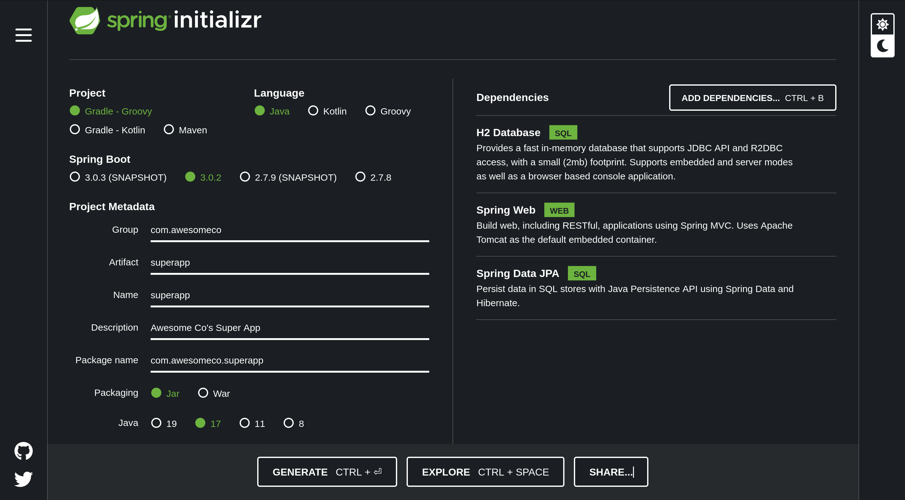

## Prerequisites

To get the most out of this tutorial, I'd recommend you have:

* Java installed on your machine, ideally the version you select in the set up below - see <a href="/posts/installing-java-for-kotlin" target="_blank">this post</a>
* Basic Kotlin language understanding
* You've opened a terminal before and can change directory
* <a href="https://www.jetbrains.com/idea/download/" target="_blank">IntelliJ</a>, or your IDE of choice installed
* Your favourite beverage to hand

_**Some help if you get stuck**_: If you run into some problems with errors, it is likely a problem with the Java version you are using, or the settings you have for IntelliJ. If you do, just jump to the bottom of the post to find the troubleshooting section.

If you're still having a problem, please open an issue on GitHub and I can do my best to help.

## So, you want to build an app, aye?

If you want to create a web app with Kotlin, you're going to need a few things. 

The first of those things you're going to need is a web server to be able to serve the stuff you're going to be creating; whether that is to millions of users, or just a local project.

Next up, you might need a way to connect to a database so that you can write some Kotlin to query against it. After that, you might want a way to create endpoints for your web app so that you can actually get some data in and out of the database.

These things, and so many more, all come in this neat package called Spring Boot.

## Where do you get all these things? 

Well, the wonderful people over at Spring have put together this handy tool called the <a href="https://start.spring.io" target="_blank">Spring Initializr</a>.

It's a click-click-done wizard that then downloads a zip file with all the dependencies you need to get started writing your Kotlin app.


Here you choose your language, the Spring Boot version, add your project metadata, and select your JVM version. If you're starting a brand new project, go for the latest LTS (long term support) version.

## Dependency... heaven? 

You can also add a plethora of dependencies that are appropriate for your project. 

Want that web server we mentioned? You've got Spring Web. 

Want to connect a SQL database? Whack in Spring Data JDBC.

Want to make sure your data migrations are as slick as can be? Sprinkle in a bit of Liquibase.

There is an absolute boat-load of dependencies to choose from, so window shop a bit and see what will fit your requirements the best.

Only choose what you need though, you don't want to end up in _dependency hell_ (imagine reading that in a big boomy voice).

## Like Lego

Like every tutorial out there, we're going to put together a simple API to walk you through the process of actually running your first Spring Boot app. 

But don't you worry. I am going to help you start to work with more advanced topics in the future; all the stuff I wish I had been able to find when I started out.



For our simple API, we have chosen:
* `Spring Web` to allow us to have a server for our app and allow us to create a RESTful API. It will automatically set up a Tomcat web server for us
* `Spring Data JPA` to allow us to connect with SQL databases using the Java Persistence API
* `H2 Database` which is an in-memory database; great for testing.
* `Gradle - Kotlin` as the build tool for this project - there's not enough Gradle content out there, so this is the beginning of my contributions.
* `Jar` is the file type we are going to package our app as 
* `Java 17` is the Java version we are going to use - the latest LTS release at the time of writing.

All we need to do now is hit `GENERATE` and we're off to the races. That will download a zip file for you and all you need to do is unzip it in the location of your choice.

## Just as good as opening presents! Well, kind of.

Now that we've got the zip file downloaded and unzipped, we can open up the folder inside your IDE of choice. I am using IntelliJ, but use whatever you're most comfortable with.


IntelliJ has gone off and started to to automatically download all the dependencies we specified in the Spring Initializr, as well as the ones that were put in there by Spring Boot.

## While it's doing that, let's take a look at what files we have in the project.

Taking a look at the contents of the `superapp` folder we have a few key files and directories. 


`gradle/` contains the files to run gradle in the project so you don't have to download it onto your computer. It comes nicely packaged in the Spring Boot starter.

`build.gradle.kts` contains everything related to building the project (no surprise there really). Currently, it has the core plugins required for Kotlin to work with Spring, the dependencies that were downloaded by IntelliJ and a feature of Gradle call `tasks`. We'll get into what all those are later on.

`gradlew` is the wrapper for Gradle: that's what we'll be use to run `build tasks`. `gradlew` is for Linux, Mac, and Windows Subsystem for Linux (WSL). 

`gradlew.bat` is the Gradle wrapper for Windows. 

`settings.gradle.kts` is the file that contains information about build projects. You can have multiple subprojects in a Gradle project, and this is where you would define that information.

## Shut up and write some code

Alright, let's write some code, shall we? 

Let's get a API up and running. We're going to need a couple of things:

1. We'll need a data model that is represented in the database.
2. We'll need a controller that will handle requests and respond with objects.
3. We'll need a schema in the database so that the database knows to create the tables on app startup.

Typically, we'd have more separation between these layers, but for the purposes of getting to the point, we'll skip a few steps. We'll come back to this stuff in later posts.

## The Data Model

Let's create the data model first.


```kotlin
package com.awesomeco.superapp.superhero

import jakarta.persistence.Column
import jakarta.persistence.Entity
import jakarta.persistence.GeneratedValue
import jakarta.persistence.GenerationType
import jakarta.persistence.Id

@Entity(name = "super_hero")
data class SuperHero (
    @Id
    @GeneratedValue(strategy = GenerationType.IDENTITY)
    val id: Long = 0,
    val name: String,
    @Column(name = "normie_name")
    val normieName: String,
)
```

We've used the Kotlin `data class` here because as we're holding data in this object. Normal classes have some methods that need to be overridden - data classes take care of that for us.

### jakarta.persistence

`jakarta.persistence` is a persistence and object/relational mapping standard which comes with Spring version `3.x` - another one you'll see is `javax.persistence`. Either one of these will be required to enable us to use this data class as an entity in the database, which...

### @Entity

Is exactly what `@Entity` does for us. Jakarta uses this to define the data model for the database and what to create a table for. The `name = "super_hero"` field specifies the name the table. In this case, it is just the lowercase version of the name of the class with an underscore `_` separating the words. 

### @Id

`@Id` adds the primary key constraint to the `id` field. `@GeneratedValue` tells the database that this is a value that needs to be generated each time a new object is saved to the database. 

`strategy = GenerationType.IDENTITY` indicates to Jakarta that it must assign primary keys for the entity. This value is also set to `0` because databases will treat that as a value that needs to have a primary key value assigned to it.

### @Column

You'll notice the annotation labelled `@Column`. All this does is define the name of the column in the database table. Typically, SQL databases have the table names and columns in lowercase with an underscore `_` between words. Just like in `@Entity`, `name = normie_name` is what we are calling that column.

## A repository for all your super heroes

This next file is pretty easy. This is what does all of the database interaction.


```kotlin
package com.awesomeco.superapp.superhero

import org.springframework.data.repository.CrudRepository
import org.springframework.stereotype.Repository

@Repository
interface SuperHeroRepository: CrudRepository<SuperHero, Long>

```

The `SuperHeroRepository` is an interface that implements the `CrudRepository` interface, which accepts two values. The name of the object you want to interact with, and the type of the primary key value. In this case, the object/table is the `SuperHero` object and the type of its primary key is `Long`.

That's it! **C**reate, **R**ead, **U**pdate, **D**elete actions are already implemented for us. Spring also does some magic for us if we want to create more adventurous database queries, but we'll explore that functionality in a later post.

Onto the controller.

## \*pssshhhh\* "This is control."

Now this is looking good.


```kotlin
package com.awesomeco.superapp.superhero

import org.springframework.web.bind.annotation.GetMapping
import org.springframework.web.bind.annotation.RequestMapping
import org.springframework.web.bind.annotation.RestController

@RestController
@RequestMapping("/super-hero")
class SuperHeroController(
    val superHeroRepository: SuperHeroRepository
) {

    @GetMapping
    fun getAllSuperHeroes(): SuperHeroResponse{
        return SuperHeroResponse(superHeroRepository.findAll().toList())
    }
}

data class SuperHeroResponse(
    val listOfSuperHeroes: List<SuperHero> = emptyList()
)
```

We've done a few things here.

1. Created a REST controller with a mapping of `/super-hero`.
2. Created an endpoint for a `GET` request on `/super-hero`.
3. Created a `SuperHeroResponse` object to make sure our RESTful API is REST compliant.
4. Connected to the `SuperHeroRepository` to make a `findAll()` query and returned that as a field within the `SuperHeroResponse` object.

Usually, we'd be making the repository calls inside a service layer, but this is for simplicity.

## Where is everybody? 

Great. We've set up the API with an endpoint of `/super-hero` that we can make `GET` requests against. We've connected to the repository that makes a `findAll()` query on the `SuperHero` entity table.

But we have no data in the database, which means we have no Super Heroes to call upon in our time of need.

Let's populate the database with our Super Heroes.


Here we have a simple SQL script in the `resources/sql` path. I created the `sql/` directory, it won't be there by default.

```sql
INSERT INTO super_hero(
    id,
    name,
    normie_name
    )
VALUES
    (1, 'Iron Man', 'Tony Stark'),
    (2, 'Batman', 'Bruce Wayne'),
    (3, 'Starlord', 'Peter Quill');
```

Next, we need to specify some details to our application. Head on over to the `application.properties` file and add in the code below.


```
spring.datasource.url=jdbc:h2:mem:superdb
spring.h2.console.enabled=true
spring.jpa.defer-datasource-initialization=true
spring.jpa.properties.hibernate.format_sql=true
spring.sql.init.schema-locations=classpath:sql/data.sql
spring.sql.init.mode=always
```

We've got a few things here that allow us to connect to the database and populate it.

`spring.datasource.driver-class-name=org.h2.Driver` provides us with the driver to use our database of choice, here being H2.

`spring.datasource.url=jdbc:h2:mem:superdb` provides us our database URL to connect to shortly. `superdb` can be changed to anything you like.

`spring.h2.console.enabled=true` allows us to access the databse from the console at the URL we defined above.

`spring.jpa.defer-datasource-initialization=true` defines that we want to have our database schema automatically created for us using the `SuperHero` data model we created above. If we wanted to create the schema manually, we would use the `spring.jpa.hibernate.ddl-auto=none` option.

`spring.jpa.properties.hibernate.format_sql=true` not required, but formats SQL in the terminal for a nicer viewing experience.

`spring.sql.init.schema-locations=classpath:sql/data.sql` tells Spring where the location of our SQL script is.

`spring.sql.init.mode=always` By default, only embedded databases (databases that are tightly integrated into the application, like H2) are initialised with SQL scripts by default. This option tells Spring to always initialise the database, regardless of it being embedded or not.

## INSPECTIONS!

Assuming you've done everything correctly, and I've not made any mistakes in the words above (words are hard sometimes), you should be able to start the application! 

There are a few ways to start the app, but we are going to do the way that is IDE agnostic - by using the terminal. If you want to use your IDE, there will be documenation for your IDE of choice.

Open up your terminal, and `cd` into your `superapp` directory. 

Now we're going to run the Gradle Wrapper file we mentioned earlier. This is going to build and run our application in development mode. 

If you're on Linux, MacOS, or Windows Subsystem for Linux (WSL) run the command:

```
./gradlew bootRun
```

If you're on Windows without WSL:
```
gradlew.bat bootRun
```

If everything went to plan, you should see something like this.


We want to see whether our database has been populated with our SQL script. If it has no data in it, something went wrong further up the line.

If you can see something like `Started SuperappApplicationKt in 1.496 seconds` at the bottom of output, next look for the line that says 

```
H2 console available at '/h2-console'. Database available at 'jdbc:h2:mem:superdb'
``` 
which should be up a few lines. If that is there, head to your browser.

In the URL bar, type in:

```
http://localhost:8080/h2-console
```

You should be presented with a login form with your database URL in the `JDBC URL` field.


Press "Connect" and you should see a SQL editor with run commands at the top and your `SUPER_HERO` table on the left.


In the text box, run the command:

```sql
SELECT * FROM super_hero
```


And you should see your data there!

Note: SQL is case insensitive, but it's common to write commands with the SQL keywords in all capitals.

## "Look! It's the Bat Signal!

Now that we know the database has been populated with data, let's check that our API works. We need to make a `GET` request against the endpoint `/super-hero` and we should be sent back an object that contains a list of super heroes. 

There are a couple of ways to _manually_ test APIs. One of them is to use an API testing platform like [Insomnia](https://insomnia.rest/) which is open-source and my choice, or there is [Postman](https://www.postman.com/) which is another popular choice.

Alternatively, if you're on Linux, MacOS or WSL, you can use this command in your terminal:

```bash
curl -X GET --location "http://localhost:8080/super-hero" | json_pp
```

`curl -X GET --location "http://localhost:8080/super-hero"` makes the `GET` request to our endpoint and `| json_pp` takes the output and pretties the JSON that is in the response by the API. 

Press enter, and you should then see this output: 


And if you received an output like that with whatever data you put in your database, then success!

And that's how you make an API in Spring Boot with Kotlin.

## That's a wrap

As you can see, with just a few lines of code and couple of files, you have a nicely organised app and with clear functionality between files.

In future posts, we'll look into the data, service, and controller layer a bit more and start work with data transfer objects, otherwise known as DTOs.

If you would like to see all the code above inside the project itself, checkout my <a href="https://github.com/lstratta/kotlin-guide/tree/main/tutorials/getting-started-kotlin-spring-boot/superapp" target="_blank">GitHub repo here for the project here</a>.

**If you found this guide helpful, feel free to share it with friends and give it a star over <a href="https://github.com/lstratta/kotlin-guide/" target="_blank">on my GitHub</a>.**

Until next time! 

## Prepare for trouble(shooting)! Make it double!

There are a couple of reasons that your app could fail, one of them being you made a typo somewhere - but I am going to assume you that you have checked over your code and your getting some errors that say things like 

`Java version 61 expected, but only java version 55 found.`

Or

`Check your module classpath for missing or conflicting dependencies.`

Well, I'll explain what each of these mean.

### Java version [insert number here] expected, but only found Java version [insert number here].

This one is quite a simple fix. It usually means that you haven't set the correct JDK, either in your terminal or in your IDE. 

**If you are in the terminal**, go check out <a href="/posts/installing-java-for-kotlin" target="_blank">this article</a> to show you how to change to the correct JDK for that terminal session.

**If you are in your IDE**, I'll show you what to do on IntelliJ. Other IDEs will have similar settings available.

The first place you want to go is the "Project Structure" settings panel in IntelliJ. You'll find that under 

`File` → `Project Structure`


Inside the Project Structure panel, you want to select "Project" and open up the tab that 

`SDK` → `Add SDK` → `JDK...`


You'll then want to navigate to the location where your JDK is installed. This could be a few different places, depending on how you installed it - if you installed Jabba, like in <a href="/posts/installing-java-for-kotlin" target="_blank">this article</a> then you'll be able to use the image below to guide you.

Jabba installs JDKs to `~/.jabba` on Linux and MacOS. On MacOS, you may have to enable hidden files with `cmd + shift + .` ← That is a full stop. 

When you find the `.jabba` directory, navigate to `JDK` then select the top level folder of JDK you want to use, like in the image. Then press `open` or `ok`, depending on your system.


If you are using Windows, you're kind of on your own as I don't have a Windows system to test this on. The idea would be the same though. Find where you installed the JDK directory and select the directory.

If you run into this problem on Windows and manage to solve it, let me know and I can update this post with your feedback.

And that _should_ solve your problem! Try running the application again.

If the problem persists, have a bit of a Google. If that still comes up short, open an issue.

### Check your module classpath for missing or conflicting dependencies

This one involves deleting some directories. They get rebuilt when you start IntelliJ and build your project.

Again, this will be for Linux and Mac, but I will provide a location that _might_ provide a fix for this on Windows but, again, I haven't been able to test this. Let me know if you manage to solve it.

Apart from restarting IntelliJ and reimporting the project, these can be done in any order:

1. Delete `~/.gradle/cahes/`
  
2. Then, either:
  
    * **Linux:** Delete `~/.cache/JetBrains/IntelliJIdea[version]`

    * **Mac:** Delete `~/Library/Application\ Support/Library/JetBrains/IntelliJIdea[version]`

    * **Windows:** Delete `C:\Users\your-user\AppData\Local\JetBrains\IntelliJIdea[Version]\.caches`

3. Delete `<project-dir>/.gradle`

4. Delete `<project-dir>/.idea`

Finally, restart IntelliJ and reimport the project.

That should be it. If you are still having issues, search the web with the errors and see if you are able to solve it.

If you have experienced different errors than what are listed here and you found method to solve it, let me know and I can add it in.

Happy coding!
